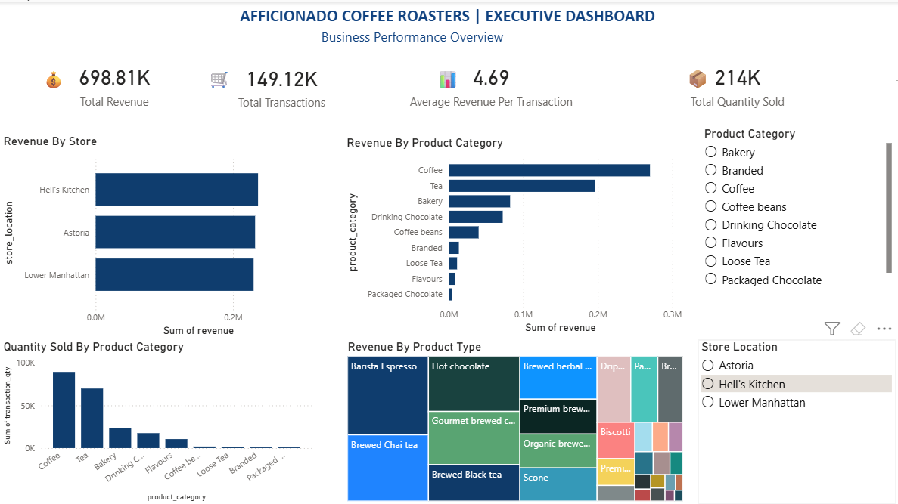
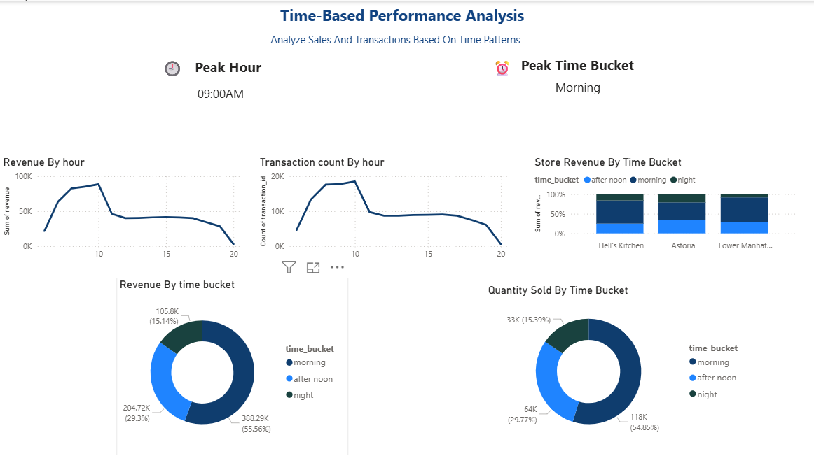
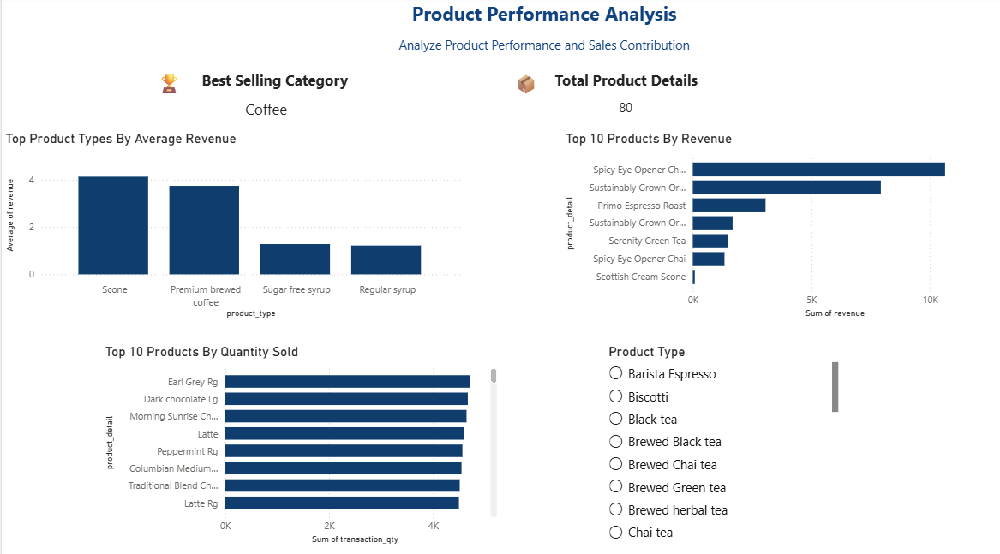

# Afficionado-Coffee-Roasters-Analysis
# Project Work Summary

The dataset was first loaded into Python using the Pandas library. Data validation was performed to assess the quality of the dataset. Duplicate records and missing values were checked, and no duplicates or null values were found.

Feature engineering was then performed. A revenue column was created by multiplying transaction quantity by unit price. The transaction time column was converted to the appropriate datetime format, and the hour was extracted from the transaction time. A time bucket column was also created to categorize transactions into Morning, Afternoon, Evening, and Late Hours.

Exploratory Data Analysis (EDA) was conducted using Pandas groupby operations. The following analyses were performed:

* Store Location vs Revenue
* Product Category vs Revenue
* Time Bucket vs Revenue
* Hour vs Revenue
* Store Location Comparison
* Product Category Comparison
* Hourly Revenue Analysis

The insights obtained from the analysis were visualized in Power BI using KPI cards and charts. The dashboard includes Total Revenue, Total Transactions, Average Revenue, Revenue by Store Location, and Revenue by Product Category visualizations.
 ## Tools Used

- Python
- Pandas
- Power BI
- DAX
- Power Query

## Dashboard Pages

### Executive Dashboard
- Total Revenue
- Total Transactions
- Average Revenue Per Transaction
- Revenue by Store
- Revenue by Product Category

### Time-Based Performance Analysis
- Peak Hour
- Peak Time Bucket
- Revenue by Hour
- Revenue by Time Bucket
- Quantity by Time Bucket

### Product Performance Analysis
- Best Selling Category
- Top Product Types by Average Revenue
- Top 10 Products by Revenue
- Top 10 Products by Quantity Sold

## Dashboard Preview

### Executive Dashboard

### Time-Based Performance Analysis

### Product Performance Analysis

